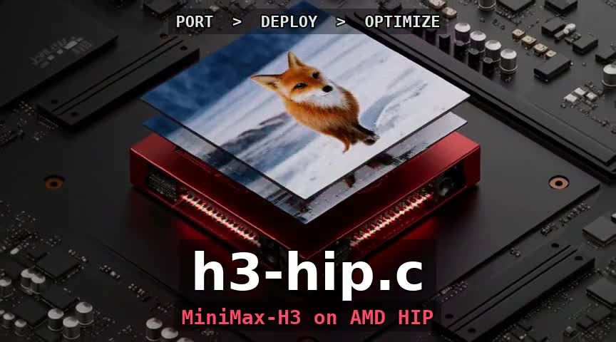
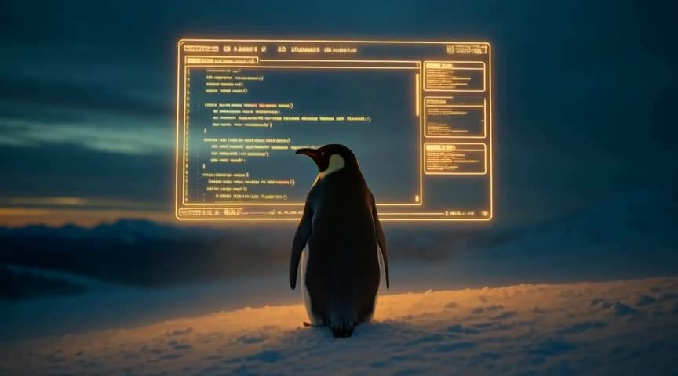
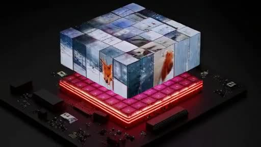
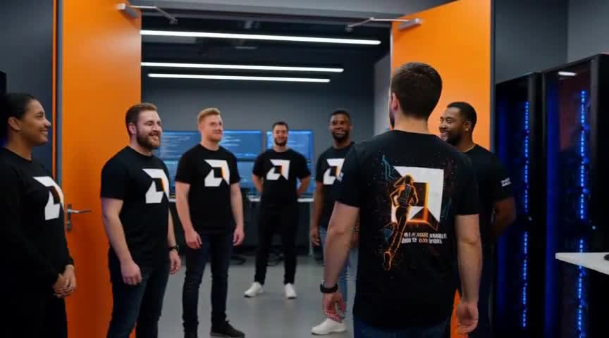
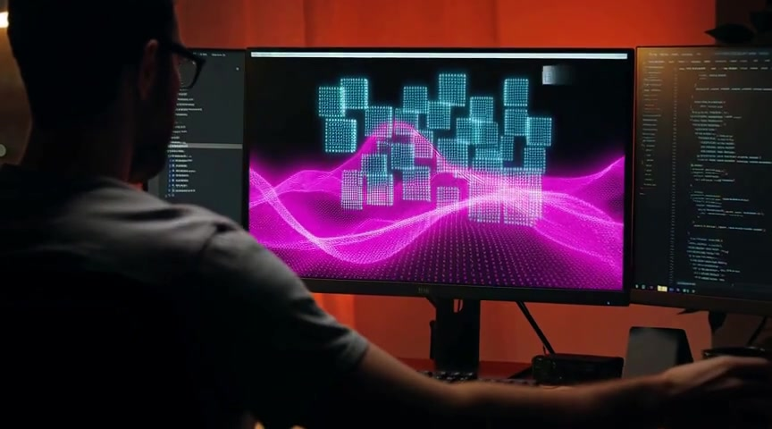
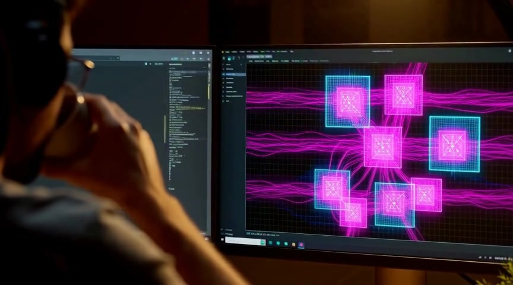

# h3-hip.c

HIP port of [antirez/h3.c](https://github.com/antirez/h3.c) for **AMD GPUs**.
One tree, three supported HIP ISAs — pass `HIP_ARCH` to match the GPU:

| ISA | GPU | Default DiT | SDPA |
|-----|-----|-------------|------|
| `gfx1151` | Strix Halo (RDNA) | INT8 + BF16 activations | wave32 rocWMMA |
| `gfx90a` | MI210 / MI250X (CDNA2) | BF16 GEMM | wave64 MFMA flash |
| `gfx942` | MI300X (CDNA3) | BF16 GEMM | wave64 MFMA flash |

Tagged **v0.10.1** on `main` is the dual-ISA line (`gfx1151` and `gfx90a`).
v0.10.0 is the same kernels; 0.10.1 adds preset/docs clarifications.
v0.9.x remains the gfx1151-only history. The original project is a native
MiniMax-H3 inference engine (Apple Metal / macOS); this repository reimplements
the GPU backend in pure HIP so the same CLI and model stack run on ROCm.

[](assets/showcase/h3-hip-ident.mp4)

Project ident, generated on gfx1151 (864×480, 56 frames, `--steps 20 --layers 50
--reuse 1`). Click the poster for the MP4:
[h3-hip-ident.mp4](assets/showcase/h3-hip-ident.mp4).

**Project page:** [alexhegit.github.io/h3-hip.c](https://alexhegit.github.io/h3-hip.c/)
**Wiki:** [github.com/alexhegit/h3-hip.c/wiki](https://github.com/alexhegit/h3-hip.c/wiki)
**Original project:** [antirez/h3.c](https://github.com/antirez/h3.c)
**CUDA sibling (DGX Spark):** [alexhegit/h3-spark.c](https://github.com/alexhegit/h3-spark.c)
**Official weights:** [MiniMaxAI/MiniMax-H3](https://huggingface.co/MiniMaxAI/MiniMax-H3)

Headline T2VA (same knobs; details in [`docs/PERFORMANCE.md`](docs/PERFORMANCE.md)):

| Preset | gfx1151 (`main` 2026-09-03) | gfx90a (`main` 2026-09-02) | gfx942 |
|--------|----------------|------------------|-----:|
| fox-s2 | ~85–90 s (I/O) | **10.8 s** | **~16 s** |
| fox-fast | ~2 min (I/O) | **18.2 s** | **~12 s** |
| 15 s cinematic (864×480, 362 f) | **40 min 46 s** | **12 min 11 s** | **~2.5 min** |

These are **complete muxed MP4s** (video + audio), not stubs. fox-s2 and
fox-fast are both **512² · 22 frames (~0.9 s at 24 fps)**; they differ only
in DiT knobs. The README fox **showcase** clip is a third preset
(`--layers 50 --reuse 1`). The 15 s cinematic reuses fox-fast quality knobs
at 864×480 / 362 frames.

| Name | Size | Knobs | Role |
|------|------|-------|------|
| **fox-s2** | 512² · 22 f | `--steps 2 --layers 35 --reuse 1` | HIP A/B + gfx1151 md5 gate |
| **fox-fast** | 512² · 22 f | `--steps 20 --layers 45 --reuse 2` | Complete short clip; 11 DiT evals; upstream “first fast video” |
| **fox showcase** | 512² · 22 f | `--steps 20 --layers 50 --reuse 1` | README / wiki gallery fox |
| **15 s cinematic** | 864×480 · 362 f | `--steps 20 --layers 45 --reuse 2` | Same quality path as fox-fast, long duration |

## Showcase (AMD gfx1151)

Clips below were generated on an AMD Strix Halo iGPU (`gfx1151`) with this HIP
port. Click a poster for the MP4. The last three are **untitled** model output
(no ffmpeg captions).

| Mode | Sample |
|------|--------|
| **T2VA** — fox tutorial clip | [](assets/showcase/t2va-fox.mp4) [mp4](assets/showcase/t2va-fox.mp4) |
| **T2VA** — Linux 35 tribute (untitled) | [](assets/showcase/linux35.mp4) [mp4](assets/showcase/linux35.mp4) |
| **T2VA** — project ident draft (untitled) | [](assets/showcase/h3-hip-ident-draft-raw.mp4) [mp4](assets/showcase/h3-hip-ident-draft-raw.mp4) |
| **Ref2VA** — AMD developer community (untitled) | [](assets/showcase/amd-developer-community-raw.mp4) [mp4](assets/showcase/amd-developer-community-raw.mp4) |
| **T2VA** — 15 s cinematic office (untitled) | [](assets/showcase/long-15s-cinematic.mp4) [mp4](assets/showcase/long-15s-cinematic.mp4) |
| **T2VA** — 10 s cinematic office (untitled) | [](assets/showcase/long-10s-cinematic.mp4) [mp4](assets/showcase/long-10s-cinematic.mp4) |

Long clips (864×480, `--steps 20 --layers 45 --reuse 2`): **15 s E2E 40 min 46 s**
and **10 s E2E ~25 min** on gfx1151; **15 s E2E 12 min 11 s** on MI210.
Opt-in `--token-reduction` on the same 15 s clip: **28.2 min** (gfx1151, 2026-09-02) /
**8 min 21 s** (gfx90a); quality trade, not the showcase path.
Timings and reproduce commands:
[`docs/perf-runs/LONG_VIDEO.md`](docs/perf-runs/LONG_VIDEO.md) ·
[Wiki: Long video](docs/wiki/Long-video.md) ·
[Project page § Long T2VA](https://alexhegit.github.io/h3-hip.c/#long).

FL2VA and Ref2VA (image, silent video, embedded soundtrack, image+audio) are
wired and smoke-tested on the same binary; see [Status](#status).

The titled ident at the top of this README is a later overlay of a 864×480
run (`--layers 50 --reuse 1`). The ident row in the table is the untitled
512×288 draft.

### Reproduce the showcase clips

Build first (`make HIP_ARCH=gfx1151` or `HIP_ARCH=gfx90a`). Then:

```bash
MODEL=/path/to/MiniMax-H3

# Fox (512², 22 frames, full layers)
./h3 -d "$MODEL" \
  -p "A red fox walks through fresh snow." \
  --width 512 --height 512 --frames 22 \
  --steps 20 --layers 50 --reuse 1 \
  -o assets/showcase/t2va-fox.mp4

# Linux 35 tribute (untitled; 864×480, 56 frames)
./h3 -d "$MODEL" \
  -p "A single penguin stands on a snowy ridge at blue hour, facing a glowing amber terminal screen floating in the cold air, scrolling lines of green monospaced code reflected in its eyes. Slow dolly-in, shallow depth of field, volumetric mist, cinematic teal and amber grade. Ambient wind, soft mechanical keyboard clicks, a low warm synth pad." \
  --width 864 --height 480 --seconds 2.33 \
  --steps 20 --layers 50 --reuse 1 \
  --seed 1991 \
  -o assets/showcase/linux35.mp4

# Project ident draft (untitled; 512×288, 56 frames)
./h3 -d "$MODEL" \
  -p "Cinematic technology project ident. In a dark graphite silicon landscape, streams of glowing model weights flow from an SSD into a powerful red GPU compute array. Magenta and amber wavefronts race through precise matrix tiles, code particles transform into a grid of moving video frames, and a realistic red fox briefly emerges from a snowy digital scene while a luminous audio waveform pulses beneath it. Slow controlled camera pullback reveals the complete accelerator board, elegant engineering visualization, AMD-red and HIP-magenta color palette, volumetric light, crisp reflections, premium cinematic motion graphics, no readable text, no logos. Sound: deep electronic startup pulse, rapid soft data clicks, rising synthesized tone, clean final impact." \
  --width 512 --height 288 --frames 56 \
  --steps 20 --layers 45 --reuse 2 \
  --seed 1991 \
  -o assets/showcase/h3-hip-ident-draft-raw.mp4

# AMD developer community (untitled Ref2VA; 864×480, 56 frames)
# Needs Ref2VA weights. Image encode on this HIP path is slow (~5 min per still).
./h3 -d "$MODEL" \
  -p "Cinematic AMD developer community invitation. Preserve the two referenced black developer T-shirt designs: first, the gold Helios chariot artwork on the back; second, the futuristic runner and open-world artwork on the front. Begin with a close view of the golden Helios shirt worn by a developer in a modern hardware lab. The camera makes a smooth orbit to reveal another developer wearing the runner shirt. Together they walk through a luminous orange open doorway into a welcoming diverse group of software engineers. Every engineer in the group, including the people further away in the background, wears the same matching black AMD team T-shirt with the crisp geometric AMD arrow emblem clearly printed on the chest and on the back, sharp white and orange print, consistent uniform team branding across the whole room. They gather around glowing code displays and an AMD-powered workstation. Confident, inclusive, collaborative energy, black graphite with AMD orange and electric blue accents, premium technology campaign, realistic fabric, crisp apparel print detail, cinematic lighting, no generated captions. Sound: subtle server room ambience, keyboard clicks, warm rising electronic pulse, uplifting final impact." \
  --ref-image assets/showcase/refs/helios-shirt.png \
  --ref-image assets/showcase/refs/run-open-shirt.png \
  --ref-image-size max \
  --width 864 --height 480 --seconds 2.33 \
  --steps 20 --layers 50 --reuse 1 \
  --seed 2026 \
  -o assets/showcase/amd-developer-community-raw.mp4

# Long T2VA — 15 s cinematic office (864×480, 362 frames;
# E2E 40 min 46 s gfx1151 / 12 min 11 s gfx90a; add --token-reduction
# for ~28 min / 8 min 21 s with a visible quality trade)
./h3 --profile -d "$MODEL" \
  -p "15 seconds, 16:9 landscape cinematic. A lone software engineer works late in a dim home office lit only by monitor glow and a desk lamp. Photoreal live-action feel with subtle handheld camera breathing.

[0–3 seconds] Medium shot from behind the desk. Code scrolls on dual monitors; warm red accent light reflects on glass. Ambient: quiet keyboard clicks, soft fan hum, distant city rain.

[3–6 seconds] Slow push-in over the shoulder. On screen, glowing matrix tiles and magenta wavefronts visualize a neural network training. The engineer pauses, sips coffee. Sound: gentle electronic pulse, a single soft notification chime.

[6–9 seconds] Cut to close-up of hands typing, then rack focus to a small window showing a red fox walking through digital snow inside the monitor reflection. Sound: rising synthesized tone, subtle wind.

[9–12 seconds] Smooth lateral move across the desk: terminal windows, GPU metrics, and a grid of video frames assembling on screen. Warm amber grade, volumetric dust in the lamp beam.

[12–15 seconds] Controlled pullback reveals the full workspace at rest. The engineer leans back, satisfied. Sound: clean final impact, room tone fades.

No readable text, no logos, no subtitles. Premium technology documentary aesthetic." \
  --width 864 --height 480 --seconds 15 \
  --steps 20 --layers 45 --reuse 2 --seed 42 \
  -o assets/showcase/long-15s-cinematic.mp4
```

## Status

Current tagged line is **v0.10.1**.

| Capability | Status |
|------------|--------|
| T2VA (text → video+audio) | ✅ |
| Dual HIP ISA (`HIP_ARCH=gfx1151` / `gfx90a` / `gfx942`) | ✅ |
| FL2VA (`--first-frame` / `--last-frame`) | ✅ |
| Ref2VA (`--ref-image`, `--ref-silent-video`, `--ref-video`, `--ref-audio`) | ✅ |
| Runtime INT8 DiT (hipBLAS) | ✅ gfx1151 default; gfx90a via `H3_INT8_MLP=1` |
| `--frames-dir` / `--ssd-streaming` | ✅ |
| `--token-reduction` | ✅ opt-in; off by default; visible quality trade |

## Documentation

- **Project page** (speedup ladder and clips): [alexhegit.github.io/h3-hip.c](https://alexhegit.github.io/h3-hip.c/)
- **Wiki sources** (also published to the GitHub wiki):
  [Getting started](docs/wiki/Getting-started.md),
  [T2VA pipeline](docs/wiki/T2VA-pipeline.md),
  [Long video](docs/wiki/Long-video.md)
- **Timings** (gfx1151 / gfx90a / gfx942): [`docs/PERFORMANCE.md`](docs/PERFORMANCE.md)
- **Known gaps:** [`docs/KNOWN_ISSUES.md`](docs/KNOWN_ISSUES.md)

The fox showcase uses `--steps 20 --layers 50 --reuse 1`. Tagged scoreboard
commands are in PERFORMANCE.md. **`--token-reduction`** is the same opt-in
speed flag as [h3-spark.c](https://github.com/alexhegit/h3-spark.c) (pair
video tokens in middle DiT blocks). It is **off by default**. Use it when
wall clock matters more than fox-s2 bit identity — long T2VA is DiT-SDPA
bound on both ISAs. gfx1151 fox-fast denoise with CLI TR was 34.6 s →
25.8 s (v0.9.0); on this tree default fox-fast denoise is **24.5 s** (all-opts
**18.0 s**). Same 15 s cinematic: gfx1151 quality path **40 min 46 s** (vs
v0.9.0 45.0 min); CLI TR **28.2 min** (2026-09-02). gfx90a **8 min 21 s**
(vs 12 min 11 s).
Tagged scoreboard stays without TR. Generate prints a stderr warning when
the flag is on.

Wiki pages not mirrored under `docs/wiki/` (Home, CLI, Showcase, Performance,
Known issues) live only on GitHub wiki. In-tree copies of Getting started,
T2VA pipeline, and Long video are under `docs/wiki/`.

## Requirements

- Linux + ROCm (`hipcc`, `libamdhip64`). Three HIP offload ISAs; you must pass
  `HIP_ARCH` to match the GPU you are building for. Other AMD targets are still
  experimental.
  - **gfx1151** — Strix Halo (RDNA). Runtime: INT8 DiT + rocWMMA SDPA.
  - **gfx90a** — MI210 / MI250X (CDNA2). Runtime: BF16 DiT + MFMA flash SDPA.
  - **gfx942** — MI300X (CDNA3). Same CDNA kernel paths as gfx90a.
- Official BF16 checkpoint at `MiniMax-H3/` (`FL2VA/*`, optional `Ref2VA/*`)
- FFmpeg / FFprobe on `PATH`
- ICU (`libicu-dev`)

## Build

Pick the ISA that matches `rocminfo` / `hipGetDeviceProperties` on **this**
machine. The Makefile does not probe the GPU.

```bash
git clone https://github.com/alexhegit/h3-hip.c.git
cd h3-hip.c
git checkout v0.10.1

# Strix Halo
make HIP_ARCH=gfx1151 -j$(nproc) h3

# MI210 / MI250X
make HIP_ARCH=gfx90a -j$(nproc) h3

# MI300X
make HIP_ARCH=gfx942 -j$(nproc) h3

./h3 --info -d /path/to/MiniMax-H3
```

`make clean` does not need `HIP_ARCH`. After changing arch, run `make clean`
before rebuilding. Halo fox-s2 md5 gate: `make HIP_ARCH=gfx1151 halo-regression`
(see [`tools/halo_regression.sh`](tools/halo_regression.sh)).

Bind one card of a multi-GPU box with `H3_HIP_DEVICE=N` (default 0) or
`HIP_VISIBLE_DEVICES=N`. On the four-GPU MI210 box: GPU 0 compile/debug,
GPU 1 quality gates, GPU 2 long T2VA, GPU 3 spare. Do not run two
weight-streaming T2VA jobs at once.
Apple Metal sources remain in-tree for reference against [antirez/h3.c](https://github.com/antirez/h3.c)
and are not the Linux build path.

## Quick generate (T2VA)

Same fox preset as the T2VA showcase clip:

```bash
./h3 --profile \
  -d /path/to/MiniMax-H3 \
  -p "A red fox walks through fresh snow." \
  --width 512 --height 512 \
  --frames 22 --steps 20 \
  --layers 50 --reuse 1 \
  -o outputs/fox.mp4
```

First run pays model load from disk (~107 GiB on this T2VA path). On gfx1151
the BIOS carveout leaves ~31 GiB host RAM, so repeat runs still miss most of
the page cache. gfx90a is a discrete GPU; its E2E is still dominated by weight
I/O on fox-s2. For the tagged scoreboard commands, see
[`docs/PERFORMANCE.md`](docs/PERFORMANCE.md).

## Conditional paths

Ordered references (`--ref-image`, `--ref-video`, `--ref-audio`, …) and
first/last-frame anchors (`--first-frame`, `--last-frame`) follow the same CLI
as [antirez/h3.c](https://github.com/antirez/h3.c).

`--ref-video` with an embedded soundtrack needs at least 2 seconds of audio
(request `--frames 56` or more). `--ref-video-audio VIDEO AUDIO` is the same
generation path with the soundtrack supplied as a separate file.

## Preview while generating

- **`--frames-dir DIR`** — write each decoded frame as PPM (works everywhere)
- **`--show`** — live denoise preview in Kitty/Ghostty/iTerm2/WezTerm/Konsole.
  Override detection: `H3_TERMINAL=kitty` (useful over SSH).
  Default terminal zoom: **1× on Linux**, 2× on macOS.

## Tests

```bash
make HIP_ARCH=gfx1151 -j$(nproc) test          # Strix Halo
make HIP_ARCH=gfx90a  -j$(nproc) test          # MI210
make HIP_ARCH=gfx1151 hip-functional
make HIP_ARCH=gfx1151 halo-regression          # Halo fox-s2 md5 gate
make HIP_ARCH=gfx90a  hip-test                 # MI210 unit + smokes
```

Set `H3_MODEL=/path/to/MiniMax-H3` if weights are not at the Makefile default.
MLX toy-block fixtures are optional; without `misc/fixtures/` those parity
targets are skipped.

## Repository layout

Host/model/CLI code follows [antirez/h3.c](https://github.com/antirez/h3.c).
The Linux build uses the HIP backend (`backends/h3_gpu_hip.c`,
`kernels/h3_kernels.hip`, `kernels/h3_kernels_extra.hip`). Pass `HIP_ARCH`
explicitly (`gfx1151` or `gfx90a`). Apple Metal sources (`h3_gpu.m`,
`h3_shaders.metal`) remain for reference against the original project and are
not the HIP build path. User-facing extra docs are under `docs/wiki/`,
`docs/PERFORMANCE.md`, and `docs/KNOWN_ISSUES.md`.

## License

See [`LICENSE`](LICENSE). Model weights are subject to the MiniMax-H3 license on
Hugging Face.
