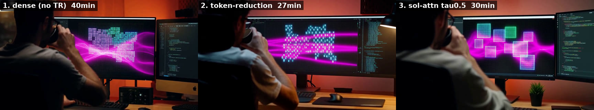

# Sol-Attn (lossy long-sequence SDPA)

**Default: quality.** Dense flash SDPA stays on unless you pass `--sol-attn`.
Do not enable this for publication, audio-sensitive, or fox-s2 identity work.

This PR has measured implementations for all three timed SKUs.

| SKU | ISA | This PR | Notes |
|---|---|---|---|
| **MI210** | `gfx90a` | **measured** | 15 s no-TR A/B below; KEEP as opt-in only |
| **MI300X** | `gfx942` | **measured** | 15 s no-TR A/B below; same MFMA kernel as MI210 |
| **Strix Halo** | `gfx1151` | **measured** | separate wave32 rocWMMA kernel; 15 s no-TR A/B below |

`--sol-attn` is an **opt-in quality/speed trade**: skipped 64-token KV tiles
are pooled into the online softmax instead of computed exactly. Keep-all
(`H3_SOL_ATTN_TAU=-100`) matches dense bit-for-bit; the default τ=0.5 path
does not. Sequences shorter than `H3_SOL_ATTN_MIN_SEQ` (default 4096) stay
dense on every ISA. Sequences up to **65536** tokens (1024 × 64-token
KV tiles) use the original static LDS route tables so 480p occupancy is
unchanged. Longer sequences (released max canvas **1344×768 · 15 s** is
**109334** tokens / **1709** tiles) use a separate 8/32 kernel with
dynamic-shared routing. Hard cap is 4096 tiles / 262144 tokens
([issue #10](https://github.com/alexhegit/h3-hip.c/issues/10)).

```bash
./h3 -d MODEL --sol-attn -p '...' --seconds 15
# or: H3_SOL_ATTN=1 H3_SOL_ATTN_TAU=0.5
# keep-all (debug): H3_SOL_ATTN=1 H3_SOL_ATTN_TAU=-100
# microbench: H3_BENCH_SDPA=1 H3_BENCH_SDPA_SOL=1 H3_BENCH_SDPA_SEQ=44800 ./h3_hip_bf16_tests
```

## Measured vs dense baseline (MI210, gfx90a)

Fixed seed, 15 s cinematic, **no token reduction**, same prompt/checkpoint as
the dense quality path. Sol-Attn τ=0.5, blocks 4–40, prefix tiles exact.
Quality is versus that dense MP4 (not versus BF16 gold).

| metric | dense (quality path) | `--sol-attn` τ=0.5 | vs dense |
|---|---:|---:|---|
| E2E | 725.31 s | 593.04 s | **−18.2%** (1.22×) |
| denoise | 634.95 s | 502.89 s | **−20.8%** |
| denoise SDPA | 456.21 s | 324.38 s | **−28.9%** |
| peak VRAM | 27.91 GiB | 27.91 GiB | unchanged |
| exact KV tiles | 100% | 33.43% | 66.57% pooled |
| video PSNR / SSIM | reference | **18.73 dB / 0.712** | preview-grade vs dense |
| decoded audio SNR | reference | **6.69 dB** | large waveform error |

SDPA kernel microbench (56 heads, d128, τ=0.5): 8,192 tokens **2.05×**,
44,800 tokens **2.56×**. fox-s2 (~1.9k tokens) stays on dense by default.

Do not stack with `--token-reduction` unless you accept compounded error.

Packed H3 layout is text/cond/audio then video. Query CTAs below
`video_target_start` already ran exact SDPA via the prefix rule; making that
explicit did not change outputs. Last-20% denoise dense
(`H3_SOL_ATTN_DENSE_TAIL=4` on 20 steps) also did not help versus dense:
video stayed ~18.72 dB / 0.713 SSIM and audio SNR ~6.67 dB, while denoise
went 503 s → 547 s and SDPA 324 s → 366 s. Default tail is therefore 0.

## Measured vs dense baseline (MI300X, gfx942)

Fixed seed, 15 s cinematic, **no token reduction**, same prompt/checkpoint as
the dense quality path. Sol-Attn τ=0.5, blocks 4–40, prefix tiles exact.
Quality is versus that dense MP4 (not versus BF16 gold).

| metric | dense (quality path) | `--sol-attn` τ=0.5 | vs dense |
|---|---:|---:|---|
| E2E | 242.53 s | 216.53 s | **−10.7%** (1.12×) |
| denoise | 182.92 s | 135.87 s | **−25.7%** |
| denoise SDPA | 142.59 s | 96.20 s | **−32.5%** |
| peak VRAM | 27.91 GiB | 27.91 GiB | unchanged |
| exact KV tiles | 100% | 33.43% | 66.57% pooled |
| video PSNR / SSIM | reference | **19.19 dB / 0.721** | preview-grade vs dense |
| decoded audio SNR | reference | **8.69 dB** | approximate |

SDPA kernel microbench (56 heads, d128, τ=0.5): 8,192 tokens **2.05×**,
44,800 tokens **2.56×**. fox-s2 (~1.9k tokens) stays on dense by default.

Same MFMA kernel as MI210; keep-all (`τ=-100`) is bit-identical to dense
(diffs 0 at all measured sequence lengths, including the 65664-token
overflow path). E2E speedup is smaller than MI210
(−10.7% vs −18.2%) because MI300X has faster baseline SDPA and other phases
(linear, VAE) form a larger fraction of E2E. SDPA speedup is higher (−32.5%
vs −28.9%) reflecting MI300X's higher MFMA throughput.

### MI300X 1344×768 · 15 s three-way (2026-09-21)

Same seed **42**, prompt, and dense-after kernel as the quality-path
1.0MP A/B. **Do not stack** `--sol-attn` with `--token-reduction`.
Ledger:
[`perf-runs/MI300X_2026-09-21_1344x768-15s-tr-sol.md`](perf-runs/MI300X_2026-09-21_1344x768-15s-tr-sol.md).

| path | E2E | denoise | sdpa | video PSNR vs dense |
|---|---:|---:|---:|---:|
| dense (no TR, no Sol) | **947.0 s** | 832.6 s | 744.2 s | reference |
| `--token-reduction` | **611.7 s** (−35%) | 497.2 s | 430.5 s | **16.9 dB** |
| `--sol-attn` τ=0.5, no TR | **719.2 s** (−24%) | 604.6 s | 516.1 s | **17.7 dB** |

Sol-Attn E2E gain is larger than at 864×480 (−24% vs −11%) because sdpa
is ~80% of process E2E at this canvas. TR remains the faster product
path; Sol-Attn remains closer to dense.

## Measured vs dense baseline (Strix Halo, gfx1151)

Fixed seed, 15 s cinematic, **no token reduction**, same prompt/checkpoint as
the dense quality path. Sol-Attn tau 0.5, blocks 4-40, prefix tiles and
text/condition/audio query CTAs exact.

| metric | dense (quality path) | `--sol-attn` tau 0.5 | vs dense |
|---|---:|---:|---|
| E2E | 2457.04 s | 1786.72 s | **-27.3%** (1.38x) |
| denoise | 2170.15 s | 1506.12 s | **-30.6%** |
| denoise SDPA | 1583.50 s | 917.19 s | **-42.1%** |
| peak VRAM | 27.91 GiB | 27.91 GiB | unchanged |
| exact KV tiles | 100% | 33.45% | 66.55% pooled |
| video PSNR / SSIM | reference | **19.55 dB / 0.721** | preview-grade vs dense |
| decoded audio SNR | reference | **10.99 dB** | approximate |

SDPA kernel microbench (56 heads, d128, tau 0.5): 8,192 tokens **1.85x**,
16,384 tokens **2.04x**, and 44,800 tokens **2.27x**. Keep-all is
bit-identical at all four measured lengths, including 1,874 and 44,800
tokens. fox-s2 stays dense under the default 4,096-token minimum.

### Halo 15 s three-way: dense vs TR vs Sol-Attn

Same seed **42**, prompt, checkpoint, 864×480 / 362 frames, reuse 2.
**Do not stack** `--sol-attn` with `--token-reduction` in this A/B.

| path | E2E | denoise | video vs dense | audio SNR vs dense |
|---|---:|---:|---|---:|
| dense (no TR, no Sol) | **2457.04 s** (40:57) | 2170.15 s | reference | reference |
| `--token-reduction` (`fox-15s.sh`) | **1666.33 s** (27:46) | 1371.25 s | **18.23 dB / 0.667** | **3.11 dB** |
| `--sol-attn` τ=0.5, no TR | **1786.72 s** (29:47) | 1506.12 s | **19.55 dB / 0.721** | **10.99 dB** |

On Halo, **TR is faster** (~2 min E2E) and **Sol-Attn is closer to dense**
on both picture and soundtrack. Neither lossy knob is a slight blur of
the quality path: blocking, props, and on-screen graphics diverge. Play
the labelled triptych (left dense, centre TR, right Sol-Attn):

[](../assets/showcase/fox-15s-3way-compare-gfx1151.mp4)

[fox-15s-3way-compare-gfx1151.mp4](../assets/showcase/fox-15s-3way-compare-gfx1151.mp4)
· stills [t=2](../assets/showcase/fox-15s-3way-t2s.jpg)
[t=5](../assets/showcase/fox-15s-3way-t5s.jpg)
[t=8](../assets/showcase/fox-15s-3way-t8s.jpg)
[t=11](../assets/showcase/fox-15s-3way-t11s.jpg)
[t=14](../assets/showcase/fox-15s-3way-t14s.jpg).

What the stills show: at **t=5 s** dense keeps a tiled matrix on the
centre monitor, TR warps it, Sol-Attn replaces it with large square
tiles. At **t=8 s** the in-monitor fox is sharpest on dense, softer on
TR, and intermediate on Sol-Attn. At **t=11 s** TR becomes a single
curved display; dense and Sol-Attn stay dual-monitor with different
lamps.

`fox-15s.sh` (TR 4:30) is **lossy versus no-TR**, not PSNR=inf. Ledger:
[`perf-runs/HALO_SOL_ATTN_2026-09-16.md`](perf-runs/HALO_SOL_ATTN_2026-09-16.md).

Full kernel / 15 s no-TR A/B notes:
[`perf-runs/HALO_SOL_ATTN_2026-09-15.md`](perf-runs/HALO_SOL_ATTN_2026-09-15.md).

Full design notes follow.

This document evaluates porting the training-free, Sol-Attn-style sparse SDPA
implemented in
[`h3-spark.c#1`](https://github.com/alexhegit/h3-spark.c/pull/1) to the HIP
backend. The feature must remain **opt-in** and must not change the default
quality path.

## Executive summary

Sol-Attn is a good match for h3-hip.c's remaining long-video bottleneck. It
routes 64-token KV tiles using a cheap proxy: selected tiles use exact matrix
attention, while skipped tiles are represented by pooled K/V statistics in the
online softmax. It needs no new model weights or training.

The CUDA code cannot be reused directly. The routing algorithm should be
ported into the existing HIP flash kernels:

- one shared host/API layer and one architecture-neutral KV-summary kernel
- one wave64 MFMA implementation shared by `gfx90a` and `gfx942`
- one separate wave32 rocWMMA implementation for `gfx1151`

Therefore this is **one algorithm with two kernel families**, not three
independent implementations. Start on MI300X (`gfx942`), validate the same
MFMA path on MI210 (`gfx90a`), then port it to Strix Halo (`gfx1151`).

## Evidence from h3-spark.c

The merged Spark implementation reports the following on GB10:

- 15 s cinematic: 1076 s to 694.7 s E2E (**-35%**)
- denoise: 988 s to 608.9 s
- SDPA: 845 s to 464 s
- output quality: PSNR 19.2 dB / SSIM 0.72 versus the dense quality path
- 44,800-token kernel: about **3x** faster
- keep-all mode (`H3_SOL_ATTN_TAU=-100`) is bit-identical to dense MMA

On the short fox-fast workload, the speedup was small and quality failed the
project's KEEP threshold. Sol-Attn is therefore a long-sequence speed option,
not a short-clip optimization.

These figures are reference evidence, not a performance promise for AMD GPUs.
HIP KEEP/REJECT decisions require measurements on each timed SKU.

## Why it fits h3-hip.c

Long T2VA is still dominated by DiT SDPA:

- Strix Halo no-TR 15 s: SDPA 1581 s of 2167 s denoise (about 73%)
- MI210 no-TR 15 s: SDPA about 466-477 s (about 72-74%)
- MI300X no-TR 15 s: SDPA about 144 s of 186 s denoise (about 77%)

The current DiT shape is also a direct fit: 56 heads and `HEAD_DIM=128`.
Sol-Attn reduces work in the long KV-tile loop without changing checkpoint
weights.

It will not materially improve cold fox-s2 E2E on Halo because weight I/O, not
SDPA, dominates that workload.

## Existing HIP kernel split

`h3_launch_sdpa_bf16` already dispatches by ISA:

| Timed product | ISA | Current long-sequence SDPA | Sol-Attn work |
|---|---|---|---|
| MI300X | `gfx942` | wave64 MFMA flash, d128 | add routing to shared MFMA kernel; tune independently |
| MI210 | `gfx90a` | wave64 MFMA flash, d128 | validate/tune the same MFMA implementation |
| Strix Halo | `gfx1151` | wave32 rocWMMA flash, d128 | separate WMMA port due to fragment and wave layout |

`gfx90a` and `gfx942` may use different optimal `WAVES` / `BK` values, but
they should share source templates. The wave32 implementation cannot safely
share matrix-fragment code with CDNA.

## Proposed behavior

Add an opt-in CLI flag and matching environment controls:

| Control | Proposed default | Meaning |
|---|---:|---|
| `--sol-attn` / `H3_SOL_ATTN=1` | off | enable sparse SDPA |
| `H3_SOL_ATTN_TAU` | `0.5` | keep tiles scoring at least mean + tau * stddev |
| `H3_SOL_ATTN_BAND` | `1` | always keep nearby KV tiles |
| `H3_SOL_ATTN_PREFIX` | derived | always keep text/condition/audio prefix tiles |
| `H3_SOL_ATTN_BLOCKS` | `4:40` | DiT blocks allowed to use sparse SDPA |
| `H3_SOL_ATTN_MIN_SEQ` | `4096` | shorter sequences stay dense on HIP |
| `H3_SOL_ATTN_DENSE_TAIL` | `0` | last N denoise steps stay dense (off; no quality win on MI210) |
| `H3_SOL_ATTN_STATS` | off | print aggregate exact/skipped tile counts |
| `H3_SOL_ATTN_DROP` | off | A/B-only mode that drops skipped tiles entirely |

Sequences shorter than 4096 tokens remain on dense SDPA after MI210
measurements showed that routing overhead exceeds the saved work below this
point. Tests can override the gate down to 512. The default generation path
must remain unchanged.

Do not enable Sol-Attn and token reduction together by default. Both reduce
attention work by different mechanisms, but their errors can compound. Measure
the combination only after each feature passes independently.

SageAttention and Sol-Attn should also be separate experimental dispatches:
Sage reduces arithmetic precision; Sol-Attn reduces the number of exact KV
tiles.

## Kernel design

### 1. Shared KV summaries

Create an architecture-neutral HIP kernel that computes, per head and per
64-token KV tile:

- K proxy/mean used by the router
- pooled V statistic used when a tile is not selected

Allocate and reuse summary/routing workspace from the HIP context. Do not
allocate per DiT block or per denoising step.

### 2. Routing

For each query block:

1. score all KV summaries
2. calculate the score mean and standard deviation
3. keep tiles above `mean + tau * stddev`
4. always keep the local band and dense prefix
5. process kept tiles through the existing exact MMA loop
6. incorporate pooled K/V for skipped tiles into the online-softmax state

`tau=-100` must take every tile through the same exact path and match dense
output bit-for-bit where the existing kernel is deterministic.

### 3. CDNA MFMA path

Modify `h3_sdpa_bf16_mfma_d128_kernel<WAVES, BK, FP16_PV>` without changing
its dense behavior:

- keep the current BF16 QK, FP16/BF16 PV, and FP32 accumulator choices
- branch at the KV-tile loop
- preserve head-major K/V handling and online-softmax rescaling
- tune MI300X and MI210 launch parameters separately, using the same source

MI300X is first because its 15 s test cycle is shortest and SDPA is the largest
fraction of denoise. MI210 is the compatibility and CDNA2 tuning pass.

### 4. RDNA rocWMMA path

Port the same routing semantics to
`h3_sdpa_bf16_wmma_d128_kernel<WAVES, BK>`. Keep it separate from MFMA
fragment handling because `gfx1151` uses wave32 and different accumulator
layouts.

Halo is last because a 15 s A/B takes roughly 40 minutes on the no-TR path.
Its potential absolute saving is large, but short clips remain I/O-bound.

## Host integration

1. Add `sol_attn` to `h3_params`, `--sol-attn` to the CLI, and an interactive
   toggle if useful.
2. At each DiT block, configure whether sparse SDPA is active and pass the
   dense-prefix tile count derived from `video_target_start`.
3. Extend the HIP context with reusable summary/routing buffers and current
   layer configuration.
4. Dispatch Sol-Attn only for supported d128 DiT shapes and sufficiently long
   sequences; otherwise use dense SDPA.
5. Print a warning that output is approximate and not bit-identical.

Text, condition, and audio KV tiles must stay exact through the prefix rule.
Audio query rows should also remain dense initially. This follows the Spark
implementation and limits cross-modal quality loss.

## Implementation phases

### Phase 0: baseline and test harness

- add a long-sequence SDPA microbenchmark for sequence lengths 1,874, 8,192,
  16,384, and 44,800
- capture dense output and timing on all three GPUs
- add a keep-all comparison test

### Phase 1: MI300X (`gfx942`)

- implement summary, routing, and the MFMA sparse loop
- verify keep-all output
- sweep tau and local band at sequence 44,800
- run fixed-seed 15 s no-TR A/B with `--profile`
- measure E2E, denoise, `sdpa=`, PSNR, SSIM, audio SNR, and peak VRAM

### Phase 2: MI210 (`gfx90a`)

- compile the shared MFMA implementation for `gfx90a`
- retune `WAVES` / `BK` only where measurements justify it
- repeat microbench, keep-all, and fixed-seed 15 s gates

### Phase 3: Strix Halo (`gfx1151`)

- implement the wave32 rocWMMA sparse loop
- run microbench first to avoid expensive failed 15 s experiments
- repeat keep-all and 15 s gates
- confirm fox-s2/default path remains unchanged

### Phase 4: combinations

Only after independent KEEP:

- Sol-Attn + token reduction
- Sol-Attn + reuse 3
- SKU-specific tau/band defaults, if quality results support them

No combination becomes the default quality path.

## KEEP / REJECT gates

### Correctness

- feature off: existing tests and fox-s2 regression remain unchanged
- keep-all: zero output differences versus the corresponding dense MMA kernel
  (gfx90a: seq 512–44800, 56 heads, `H3_SOL_ATTN_TAU=-100`);
  (gfx942: seq 8192–44800, 56 heads, diffs 0);
  (gfx1151: seq 512 targeted test and seq 1874–44800 microbench, diffs 0)
- unsupported/short shapes: verified dense fallback

### Performance

For 44,800 tokens, target at least:

- **2x** SDPA kernel speedup in sparse mode
- **20%** reduction in 15 s `sdpa=`
- no material regression outside SDPA

MI210 (`gfx90a`) microbench, 56 heads, d128, 3 iters:

| seq | dense | keep-all | tau=0.5 | vs dense |
|---:|---:|---:|---:|---:|
| 1,874 | 30.1 ms | 32.3 ms | 23.9 ms | 1.26x |
| 8,192 | 534.8 ms | 539.8 ms | 261.4 ms | 2.05x |
| 16,384 | 2.11 s | 2.12 s | 0.91 s | 2.33x |
| 44,800 | 15.69 s | 15.75 s | 6.12 s | **2.56x** |

MI210 fixed-seed 15 s no-TR A/B after batching 16 pooled pseudo-KV tiles
through MFMA for both QK and PV:

| metric | dense | Sol-Attn τ=0.5 | change |
|---|---:|---:|---:|
| E2E | 725.31 s | 593.04 s | **−18.2%** |
| denoise | 634.95 s | 502.89 s | **−20.8%** |
| denoise SDPA | 456.21 s | 324.38 s | **−28.9%** |
| peak VRAM | 27.91 GiB | 27.91 GiB | unchanged |
| exact KV tiles | — | 33.43% | 66.57% skipped |
| video PSNR / SSIM | reference | 18.73 dB / 0.712 | approximate |
| decoded audio SNR | reference | 6.69 dB | approximate |

Same 15 s numbers as the table at the top of this document. Speed meets the
20% SDPA gate; quality stays **REJECT for default on** (preview video, weak
audio). Duplicate table kept only for the KEEP checklist.

MI300X (`gfx942`) microbench, 56 heads, d128, 3 iters:

| seq | dense | keep-all | tau=0.5 | vs dense |
|---:|---:|---:|---:|---:|
| 8,192 | 272.9 ms | 280.1 ms (diffs 0) | 133.1 ms | **2.05x** |
| 44,800 | 8083.8 ms | 8161.2 ms (diffs 0) | 3161.2 ms | **2.56x** |

MI300X fixed-seed 15 s no-TR A/B (same MFMA kernel as MI210):

| metric | dense | Sol-Attn τ=0.5 | change |
|---|---:|---:|---:|
| E2E | 242.53 s | 216.53 s | **−10.7%** |
| denoise | 182.92 s | 135.87 s | **−25.7%** |
| denoise SDPA | 142.59 s | 96.20 s | **−32.5%** |
| peak VRAM | 27.91 GiB | 27.91 GiB | unchanged |
| exact KV tiles | — | 33.43% | 66.57% skipped |
| video PSNR / SSIM | reference | 19.19 dB / 0.721 | approximate |
| decoded audio SNR | reference | 8.69 dB | approximate |

SDPA speedup exceeds MI210 (−32.5% vs −28.9%) due to higher MFMA throughput.
E2E speedup is smaller (−10.7% vs −18.2%) because MI300X's faster baseline
makes non-SDPA phases (linear, VAE) a larger E2E fraction. Quality matches
MI210 within noise (19.19 vs 18.73 dB PSNR, 0.721 vs 0.712 SSIM).

Strix Halo (`gfx1151`) microbench, 56 heads, d128, 3 iters, wave32 rocWMMA:

| seq | dense | keep-all | tau=0.5 | vs dense |
|---:|---:|---:|---:|---:|
| 1,874 | 6.9 ms | 8.2 ms (diffs 0) | 5.9 ms | 1.16x |
| 8,192 | 114.1 ms | 130.1 ms (diffs 0) | 61.7 ms | 1.85x |
| 16,384 | 440.1 ms | 481.9 ms (diffs 0) | 215.9 ms | 2.04x |
| 44,800 | 3286.2 ms | 3776.2 ms (diffs 0) | 1445.6 ms | **2.27x** |

Strix Halo fixed-seed 15 s no-TR A/B:

| metric | dense | Sol-Attn τ=0.5 | change |
|---|---:|---:|---:|
| E2E | 2457.04 s | 1786.72 s | **−27.3%** |
| denoise | 2170.15 s | 1506.12 s | **−30.6%** |
| denoise SDPA | 1583.50 s | 917.19 s | **−42.1%** |
| peak VRAM | 27.91 GiB | 27.91 GiB | unchanged |
| exact KV tiles | — | 33.45% | 66.55% skipped |
| video PSNR / SSIM | reference | 19.55 dB / 0.721 | approximate |
| decoded audio SNR | reference | 10.99 dB | approximate |

Absolute SDPA saving is largest on Halo (−666 s). Quality stays **REJECT for
default on**. Kernel A/B:
[`perf-runs/HALO_SOL_ATTN_2026-09-15.md`](perf-runs/HALO_SOL_ATTN_2026-09-15.md).
Dense vs TR vs Sol-Attn (Halo stills + triptych):
[`perf-runs/HALO_SOL_ATTN_2026-09-16.md`](perf-runs/HALO_SOL_ATTN_2026-09-16.md).

Reject or retune if routing/summary overhead erases the gain, particularly on
short sequences.

### Quality

Use the same prompt, seed, geometry, layers, reuse, and checkpoint as the dense
15 s baseline. Record:

- video PSNR and SSIM
- audio waveform SNR
- representative MP4s for visual/temporal inspection

Spark's 19.2 dB / 0.72 is a reference point, not an automatic HIP default.
HIP KEEP for **default on** would need audio closer to the dense waveform.
Until then the dense path is the quality default; `--sol-attn` is documented
lossy acceleration only.

## Risks

- Divergent tile decisions can lower wave occupancy or serialize work.
- Summary and pooled-value traffic may consume much of the theoretical saving.
- Optimal tile geometry may differ between CDNA2, CDNA3, and RDNA3.5.
- Approximation error compounds across DiT blocks and can affect audio through
  cross-modal feedback even when audio tiles remain dense.
- A kernel-only 3x gain will not produce a 3x E2E gain because linear layers,
  VAE, weight loading, and dense DiT blocks remain.

## Expected result

The project treats Sol-Attn as optional long-video **lossy** acceleration.
MI210 already meets the 20% SDPA speed gate; quality does not meet a default-on
bar. Preserve the dense path exactly when the flag is off.
