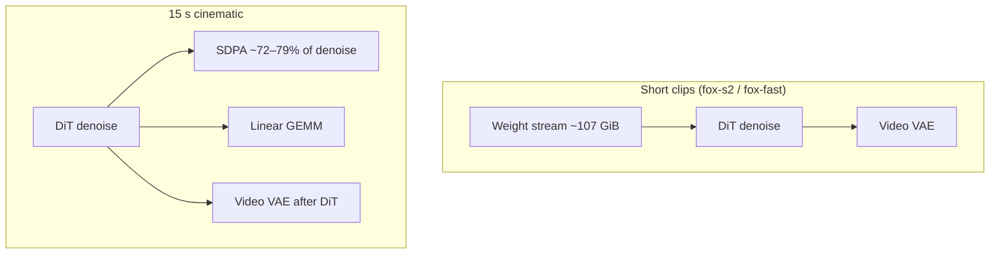

# Optimizations

How h3-hip.c got from a working HIP port to three timed SKUs — **Strix Halo
(gfx1151)**, **MI210 (gfx90a)**, **MI300X (gfx942)** — and what each lever
actually does.

This page is the **narrative**. Numbers live in
[`docs/PERFORMANCE.md`](../PERFORMANCE.md). Knob recipes live in
[`docs/BEST_PRACTICE.md`](../BEST_PRACTICE.md). Pipeline dtypes live in
[T2VA pipeline](T2VA-pipeline.md). Reproduce commands for long clips live in
[Long video](Long-video.md).

No distillation, no fine-tune, no new MiniMax-H3 checkpoint. Runtime
quantization, kernel work, memory layout, and two opt-in **lossy** long-video
paths (token reduction and Sol-Attn).

## Scoreboard snapshot (v0.12.0, 2026-09-12)

Same CLI, same MiniMax-H3 weights, one `HIP_ARCH` per binary. Complete muxed
MP4s (video + audio), not stubs.

| Preset | Strix Halo | MI210 | MI300X |
|--------|-----------:|------:|-------:|
| fox-s2 E2E | ~85–90 s (I/O) | **11.2 s** | **3.3 s** |
| fox-fast E2E | ~2 min (I/O) | **19.5 s** | **5.2 s** |
| 15 s cinematic, dense, no TR | **40 min 4 s** | **12 min 12 s** | **179.5 s** |
| 15 s `./bench/fox-15s.sh` (TR 4:30) | **26 min 56 s** | **8 min 13 s** | **114.7 s** |
| 15 s-fast `fox-15s-fast.sh` | **20 min 44 s** | **6 min 18 s** | **83.1 s** |

fox-s2 / fox-fast are **512² · 22 frames**. 15 s cinematic is **864×480 · 362
frames**, `--steps 20 --layers 45 --reuse 2`. Treat E2E as a band (page cache);
denoise GPU time is the stable figure. Peak live-tensor VRAM on the 15 s path
is **27.9 GiB** with default INT8 DiT.

MI300X vs the other two on the **same** 15 s quality path: **4.1×** MI210,
**13.4×** Halo. That is the minutes-level story. The TR rows are faster and
lossy; do not quote them as the quality path.

## Where the time actually goes



| Workload | Halo (gfx1151) | MI210 / MI300X |
|----------|----------------|----------------|
| fox-s2 / fox-fast **E2E** | NVMe / host RAM. Denoise is a small slice (~3.8 s / ~26 s). ~31 GiB host vs ~107 GiB weights. | Weight I/O still visible; denoise is already sub-second (s2) to a few seconds (fast). |
| 15 s **denoise** | SDPA-bound (1581 s of 2167 s, ~73%). | Same shape: MI210 SDPA ~466 s of 647 s; MI300X ~140 s of 176 s (~79%). |

Optimizations that only shrink SDPA will not move Halo fox-s2 E2E. Optimizations
that only shrink I/O will not move a 15 s cinematic.

## Quality vs speed (read this first)

Default on all three ISAs: **INT8 DiT weights, dense flash SDPA**. That is the
tagged scoreboard.

| Lever | Default | Quality | When it pays |
|-------|---------|---------|--------------|
| INT8 DiT | **on** | Small drop vs BF16 (typical ~29.5 dB vs ~33.5 dB gold on MI300X fox-s2) | Always — VRAM and linear. `H3_INT8_MLP=0` restores BF16. |
| Flash SDPA on matrix cores | **on** | Keep-all / dense path is the identity | Always — this *is* the quality SDPA. |
| Larger VAE tiles (480/512 px) | **on** | fox-s2 bytes changed vs v0.9.0 | Always — fewer tiles. |
| INT8 Video VAE | off | Decode quality usually holds; VAE wall may not fall | VRAM (peak 10.2 → 3.7 GiB). |
| GPU Euler sampler | off | Bit-identical intent (latents stay on device) | MI300X short denoise. **Not** a Halo short-clip win. |
| Token reduction | off | **Lossy.** Halo 15 s vs dense: 18.23 dB / 0.667, audio SNR 3.11 dB | Long video wall clock (~−37% denoise at 4:30). |
| Sol-Attn | off | **Lossy.** Preview-grade vs dense; audio SNR drops | Long SDPA (~−29% to −42%). Do not stack with TR by default. |
| FP8 DiT | off | Experimental; ~25.9 dB vs BF16 gold on fox-s2 | gfx942 only. |

Same-seed Halo 15 s three-way (do not stack TR + Sol-Attn):

| Path | E2E | vs dense video | vs dense audio |
|------|----:|----------------|----------------|
| dense (quality) | 40:57 | reference | reference |
| `--token-reduction` | 27:46 | 18.23 dB / 0.667 | 3.11 dB |
| `--sol-attn` τ=0.5 | 29:47 | 19.55 dB / 0.721 | 10.99 dB |

TR is faster. Sol-Attn is closer to dense. Both diverge on blocking and
on-screen graphics. Watch
[fox-15s-3way-compare-gfx1151.mp4](../../assets/showcase/fox-15s-3way-compare-gfx1151.mp4).

---

## 1. Matrix-core SDPA and GEMM

The first large GPU win was moving attention and the hot linears onto the
matrix units instead of scalar/vector paths.

| ISA | Wave | Attention | Linear |
|-----|------|-----------|--------|
| gfx1151 | 32 | rocWMMA tiled **d128** flash SDPA; d64 path in VAE | hipBLAS INT8 DiT; F32 VAE; fused QKV+RoPE |
| gfx90a / gfx942 | 64 | MFMA flash: **BF16 QK**, **FP16 PV**, FP32 accum | hipBLAS INT8 DiT (default); F32 VAE |

Compile-time split via `HIP_ARCH`. The two CDNA cards share source templates;
Halo cannot share wave32 fragment code with CDNA.

On Halo, this era (through **v0.9.x**) took fox-s2 denoise from ~40 s to
**6.3–6.5 s** and video VAE GPU from ~54 s to ~5 s. Later INT8 workspace reuse
cut fox-s2 denoise further to **~3.4–3.8 s**. Those denoise numbers are now a
small fraction of Halo E2E.

Code: `kernels/h3_kernels.hip`, `kernels/h3_kernels_extra.hip`, dispatch in
`backends/h3_gpu_hip.c`.

## 2. INT8 DiT (default) and persistent workspace

Checkpoint weights stay BF16 on disk. At load, DiT QKV / out / FC quantize to
INT8. Activations stay BF16. That is **not** a second checkpoint.

Two separate wins:

1. **Arithmetic and VRAM.** DiT weights ~62 → ~28 GiB. 15 s pipeline peak
   ~41 → **27.9 GiB**, which is what makes 15 s fit a 32–64 GiB card.
2. **Allocation churn.** A persistent INT8 workspace replaced per-block
   quantize buffers. PERFORMANCE.md records this as eliminating on the order of
   **2500 GiB** of allocate/free traffic per run. Encode-side quantize time
   collapsed (MI300X: denoise encode ~179 s → **0.06 s** in that experiment).

On MI210, INT8 linear can be slightly **slower** than BF16 hipBLAS; the VRAM
cut is still the reason it is default. On MI300X, INT8 linear is faster
(15 s: 34.6 → 28.5 s in the v0.11 A/B).

`H3_INT8_MLP=0` is the gold-ish BF16 path for A/B. Naive hand-written INT8 WMMA
tiles were rejected early (~4% of BF16 WMMA peak); production INT8 GEMM is
hipBLAS.

## 3. Weight residency and I/O overlap (Halo-shaped, still relevant)

One T2VA run streams on the order of **107 GiB**. On Strix Halo the BIOS split
is typically **96 GiB VRAM carveout + ~31 GiB host**. If weights bounce through
that 31 GiB, E2E is NVMe.

What landed:

- Weights live in the VRAM carveout (`hipMallocManaged` / device-resident
  loaders), not a host-side working set.
- Loaders `pread` into a **recycled pinned staging** buffer.
- **AdaLN projection prefetch** overlaps the next block’s tiny F32 norms with
  the current block.
- A **video-VAE loader thread** overlaps decode setup with DiT.

On MI210 / MI300X the same loaders still matter for cold start, but 15 s is
compute-bound once weights are resident.

## 4. Video VAE tiles and INT8 VAE

The 3D decoder used to tile too finely (v0.9.0-era **272 px** at 864×480 → 8
tiles per chunk). `configured_tile_pixels()` now scans 256–512 px and picks
the size that minimises `tiles × pixels²`.

| Resolution | Old | Current | Effect |
|------------|-----|---------|--------|
| 512² fox-s2 | 288 px, 2×2 | **512 px, 1×1** | fox-s2 bytes changed (`34507f07…` vs v0.9.0 `1731f95c…`) |
| 864×480 15 s | 272 px, 2×4 | **480 px, 2×1** | fewer submissions; VAE wall about **−12%** on MI300X |

`H3_INT8_VAE=1` quantizes VAE linears on the fly with a persistent workspace.
Linear GEMM can drop by two orders of magnitude; **per-tile input quantize**
shows up as VAE “other” time, so **VAE wall often does not fall**. Use it for
VRAM (peak **10.2 → 3.7 GiB**), not as a 15 s E2E hammer.

A fused quantize+GEMM kernel exists and is **not** default: it rereads F32
input and loses on long sequences (15 s VAE 28 s → 58 s in that A/B).

## 5. GPU Euler sampler

Default Euler keeps latents on the host between steps. `H3_GPU_SAMPLER=1`
leaves them on device.

| SKU | Verdict |
|-----|---------|
| MI300X fox-s2 | Large denoise cut in early A/Bs (round-trips dominated a ~1–2 s denoise). |
| Halo short clips | **Not a win** (2026-09-03: fox-s2 3.36 → 3.51 s). |
| 15 s | In the noise next to SDPA. |

Leave it on for MI300X latency recipes; do not expect it to move Halo 15 s.

## 6. Token reduction (lossy, opt-in)

`--token-reduction` / `H3_TOKEN_REDUCTION=1` **pairs video tokens** in middle
DiT blocks (default range **4:30**), so long-N SDPA sees roughly half the
spatial width. Text / cond / audio tokens are not the pairing target.

15 s denoise vs the dense no-TR path is about **−37%** on all three timed
SKUs at 4:30. That is why `fox-15s.sh` exists.

`H3_TOKEN_REDUCTION_SCHEDULE=STEP:BEGIN:END,...` varies the range per denoise
step (wider early, tighter late). Setting the schedule **enables** TR.
On-demand only: `./bench/fox-15s-sched.sh` — not the tagged `bench/`
scoreboard. See [issue #4](https://github.com/alexhegit/h3-hip.c/issues/4).

Quality: spatial detail (fur, textures) softens in the reduced blocks;
temporal structure usually holds. Halo three-way shows TR also **changes
blocking**, not just sharpness. Do not use for fox-s2 identity or
publication stills.

Code: `h3_dit.c` / `h3_dit_schedule.c`.

## 7. Sol-Attn (lossy long SDPA, opt-in)

Long T2VA is still ~3/4 SDPA even after INT8 and flash kernels. Sol-Attn is
training-free sparse attention:

1. A cheap **KV-summary** kernel stores per-64-token-tile mean-K and sum-V.
2. Queries score those summaries (Q-bar vs K-mean). Keep tiles above
   `mean + τ·stddev` (default **τ=0.5**), plus a local band and the
   text/cond/audio **prefix**.
3. Kept tiles run **exact** flash SDPA. Skipped tiles enter the **online
   softmax** as pooled statistics, not as dropped mass.

Implementation split (one algorithm, two kernel families):

| Product | Kernel |
|---------|--------|
| MI210 + MI300X | Shared wave64 MFMA in `kernels/h3_kernels_sol.hip`. Skipped tiles batch as pseudo-KV (up to 16) and go through MFMA QK/PV — a global-Q scan per skipped tile was slower than dense. |
| Strix Halo | Separate wave32 rocWMMA sparse kernel. |

Host gate (`backends/h3_gpu_hip.c`): feature flag, per-block range (default
blocks **4–40**), **`H3_SOL_ATTN_MIN_SEQ` default 4096**. fox-s2 (~1.9k tokens)
stays dense so routing overhead cannot regress short clips.

Keep-all (`H3_SOL_ATTN_TAU=-100`) is **bit-identical** to dense on all three
ISAs. That isolates approximation to the router.

15 s no-TR vs dense (same seed, τ=0.5):

| SKU | E2E | SDPA | Video vs dense | Audio SNR |
|-----|----:|-----:|----------------|----------:|
| Halo | **−27.3%** | **−42.1%** | 19.55 dB / 0.721 | 10.99 dB |
| MI210 | **−18.2%** | **−28.9%** | 18.73 dB / 0.712 | 6.69 dB |
| MI300X | **−10.7%** | **−32.5%** | 19.19 dB / 0.721 | 8.69 dB |

MI300X E2E speedup is smaller because baseline SDPA is already fast; linear
and VAE are a larger slice of the wall. SDPA itself still drops ~⅓.

Full design, microbenches, and the Halo triptych:
[`docs/SOL_ATTN.md`](../SOL_ATTN.md).

## 8. Fused gate + AdaLN

DiT residual blocks used a two-kernel **gate then AdaLN** sequence. v0.12.0
fuses them. Tests in `tests/test_bf16.c` check the fused path against the
two-kernel reference. A later Halo fix kept fused AdaLN’s **float max** and
only corrected the **short-row reduce** (gfx1151 `halo-regression`).

This is a denoise “other” / launch-overhead cut, not an SDPA story.

## 9. FP8 DiT (gfx942 experimental)

`H3_FP8_MLP=1` uses hipBLASLt, **E4M3 FNUZ**, FP32 accumulate, scale+cast
epilogue back to BF16. Ignored on gfx1151 / gfx90a.

- Default clip `H3_FP8_CLIP=0.95` (+1.2 dB vs clip 1.0 on fox-s2).
- 15 s E2E roughly **−6% vs BF16**, **−3% vs INT8**, peak VRAM ~30.9 GiB.
- PSNR sits below INT8 (~25.9 vs ~29.5 dB). INT8 stays the default.

Not the MI300X headline. The minutes-level 15 s number is **INT8 + dense
flash**, 179.5 s.

---

## What to turn on

```bash
# Quality path (tagged scoreboard) — INT8 DiT is already default
./h3 --profile -d MODEL -p '...' --seconds 15 -o out.mp4

# Long-video speed, accept TR quality
H3_INT8_VAE=1 H3_TOKEN_REDUCTION=1 ./h3 ...    # or ./bench/fox-15s.sh

# Long-video speed, Sol-Attn instead of TR (usually better picture/audio than TR)
./h3 --sol-attn ...                            # do not add --token-reduction

# MI300X latency extras
H3_GPU_SAMPLER=1 H3_INT8_VAE=1 ./h3 ...
```

`--profile` / `H3_PROFILE=1` prints per-phase GPU time with op-class breakdown
(sdpa / linear / other). That is how we know 15 s is still SDPA-bound.

## Code map

| Area | Where |
|------|--------|
| Public CLI / flags | `h3_cli.c`, `h3.h` |
| DiT blocks, TR range, Sol-Attn block gate | `h3_dit.c`, `h3_dit_schedule.c` |
| HIP dispatch, INT8 workspace, Sol-Attn scratch | `backends/h3_gpu_hip.c` |
| Dense flash + WMMA/MFMA | `kernels/h3_kernels.hip`, `kernels/h3_kernels_extra.hip` |
| Sol-Attn sparse + KV summary | `kernels/h3_kernels_sol.hip` |
| Video VAE tiles / INT8 VAE | `h3_video_vae.c` |

Engineering logs (KEEP/REJECT, nightlies) under `docs/perf/` and
`docs/perf-mi210/` are **not** the release scoreboard.
