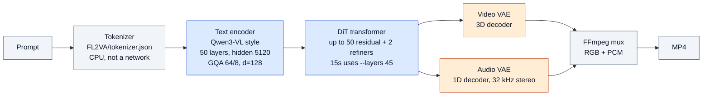

# T2VA pipeline (models and dtypes)

Text-to-video+audio on official [MiniMax-H3](https://huggingface.co/MiniMaxAI/MiniMax-H3)
weights. There is no separate FP32 dump of Qwen/DiT and no INT8/FP8 checkpoint.
Runtime INT8 exists for DiT on Strix Halo (gfx1151); on MI210 (gfx90a) it is off
unless `H3_INT8_MLP=1`.

T2VA does not load `FL2VA/`, `Ref2VA/`, or `transformer_ref`. Vision encoder and
VAE encoders run only with `--first-frame` / `--ref-*`.

## Forward path



Blue = BF16 weights. Orange = F32 weights. Gray = no neural-net weights.

## Disk vs compute

Checkpoint dtypes do not change with `HIP_ARCH`. Runtime compute does.

| Stage | Disk dtype | Size (approx.) | Strix Halo (gfx1151) | MI210 (gfx90a) |
|---|---|---:|---|---|
| Tokenizer | — | — | CPU | CPU |
| Text encoder | **BF16** | 62.1 GiB | BF16 RMS / hipBLAS / causal GQA | same (no INT8) |
| DiT | **BF16** + tiny **F32** AdaLN | 61.7 + 0.06 GiB | INT8 QKV/out/FC (default), rocWMMA SDPA | BF16 hipBLAS linear; flash SDPA BF16 QK, FP16 PV MMA, FP32 accum |
| Video VAE | **all F32** | 9.7 GiB | F32 linear + rocWMMA d64 | F32 linear + MFMA d64 flash |
| Audio VAE | **F32** | (decoder load) | F32 conv / Snake | same |
| Mux | — | — | FFmpeg | FFmpeg |

T2VA shards on disk total about **133.6 GiB**: ~124 GiB BF16 (Qwen + DiT) and
~9.8 GiB F32 (video VAE + DiT norms). Phases are sequential, so peak residency
is much smaller than the sum.

Build: `make HIP_ARCH=gfx1151` or `make HIP_ARCH=gfx90a`
([Getting started](Getting-started.md)).

## Knobs that change DiT dtype at runtime

```text
H3_INT8_MLP=1          # MI210/MI300X: INT8 DiT (already the Strix Halo default)
H3_INT8_MLP=0          # Strix Halo: keep BF16 DiT weights
H3_SDPA_CDNA_FP16_PV=0 # gfx90a flash: BF16 PV instead of default FP16
H3_SDPA_CDNA_FLASH=0   # gfx90a: hipBLAS score-matrix fallback
```
